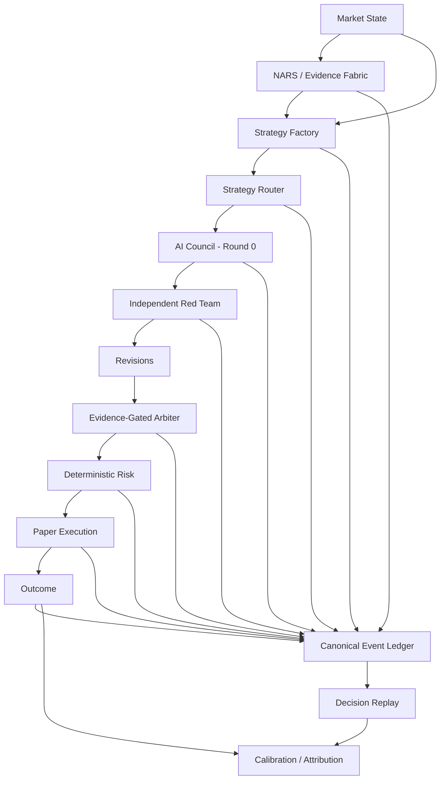

# BLACK ORACLE

**An auditable AI investment operating system.**

BLACK ORACLE is an experimental investment engine designed to connect market state, evidence, strategy selection, multi-agent review, deterministic risk, Paper execution, and realized outcomes through replayable decision lineage.

> **Evidence → Strategy Factory → Router → AI Council → Red Team → Arbiter → Risk → Execution → Outcome**
>
> Every important decision should be explainable after the fact from the information available at the time.

**Current stage:** active development · PAPER qualification · AI Council remains shadow-only · no claim of production-live autonomous capital authority.

---

## Why BLACK ORACLE exists

Most trading systems show the result of a decision. BLACK ORACLE is being built to preserve the **decision itself**.

For each meaningful candidate, the target system records:

- what the market looked like,
- which evidence was available,
- which strategies were eligible or rejected,
- why the Router selected a strategy or `NO_TRADE`,
- what independent Council agents believed before debate,
- what the Red Team challenged,
- what the Arbiter concluded,
- what deterministic Risk allowed or rejected,
- what order/fill actually occurred,
- and what happened afterward.

The goal is not an AI that merely says **BUY** or **SELL**. The goal is an investment operating system that can answer:

> **Why did you take this risk, what information did you use, what could have invalidated the decision, and which layer added or destroyed value?**

---

## Core architecture



`LONG`, `SHORT`, and `NO_TRADE` are first-class decisions. Missing evidence is represented as a data gap rather than silently fabricated.

---

## What is implemented now

### Strategy intelligence

- Strategy Factory and strategy candidate lifecycle
- Strategy Router
- Challenger / Shadow concepts with hard-gated promotion direction
- Monte Carlo and validation utilities
- crypto PAPER runtime
- KRX equity PAPER path

### AI Council v3

The Council is structured as a **Primary Team + Independent Red Team + Evidence-Gated Arbiter**, not a simple majority vote.

Core roles include:

- Chief Market Strategist
- Evidence Intelligence Officer
- Quant & Model Validation Lead
- Trade Architect
- Director of Adversarial Research — independent Red Team
- dynamic specialists for macro, fundamentals, microstructure, derivatives, and portfolio context

The Council separates `FACT`, `INFERENCE`, `ASSUMPTION`, `COUNTEREVIDENCE`, and `DATA_GAP`. Its current authority is deliberately **shadow-only** so it can be evaluated against outcomes without silently gaining execution authority.

### Canonical Event Ledger

Paper observations and execution history are projected into an append-oriented canonical audit layer, including:

- `EVIDENCE`
- `STRATEGY`
- `RISK`
- `ORDER`
- `TRADE`
- `OUTCOME`
- `SYSTEM`

The design separates recovery state from long-lived audit history so a runtime checkpoint does not need to be the only source of truth.

### Decision Replay v2

Decision Replay reconstructs the path around a decision and its outcome. Current calibration primitives include:

- source-backed directional forecast extraction,
- outcome-linked Brier score,
- absolute probability error,
- directional correctness,
- empirical return distributions for sufficiently sampled probability buckets,
- explicit sample gates that return unavailable values instead of inventing statistics.

### Runtime integrity

The runtime is being hardened around:

- process liveness separated from deep trading health,
- durable Paper checkpoints,
- bounded persistence retries,
- atomic in-memory rollback when a checkpoint cannot commit,
- scheduler and persistence latency telemetry,
- canonical event retry windows,
- frozen qualification-cohort protection.

---

## Safety and authority model

BLACK ORACLE treats authority as something that must be **earned by evidence**.

1. New intelligence layers begin in `SHADOW`.
2. AI Council does not override deterministic Risk.
3. Strategy, risk, sizing, or execution semantics are never silently changed inside an existing qualification cohort.
4. Missing data is displayed as missing.
5. Promotion is hard-gated by prospective evidence, not by a polished UI or a single profitable period.
6. Historical decisions are not retrospectively rewritten as if a newer policy had existed.
7. PAPER → Canary Live requires explicit validation and operational gates.

The monthly performance objective used internally is a target, **not proof of edge and not a substitute for risk/validation gates**.

---

## Qualification philosophy

A strategy or full-system candidate should not reach higher authority only because win rate looks good.

The validation model is designed to consider, where available:

- out-of-sample / walk-forward performance,
- expectancy and payoff ratio,
- max drawdown,
- Sharpe / Sortino,
- Monte Carlo survival,
- regime stability,
- parameter robustness,
- sample size,
- evidence quality,
- reproducibility,
- execution sensitivity,
- calibration,
- and operational reliability.

BLACK ORACLE uses a credit-style grade vocabulary (`AAA+` through `F-`) as a common language, but grades are intended to remain **composite and hard-gated**, never cosmetic conversions of win rate.

---

## Product surface

The current mobile operating surface follows an `Oracle → Decision → Replay → Outcome` flow and consumes real read-only runtime contracts where available.

| Surface | Purpose |
| --- | --- |
| **Oracle** | market state, current decisions, trade map, system state |
| **Decision** | Router, Council, Red Team/Arbiter, deterministic Risk |
| **Replay / Traces** | canonical event lineage and historical reconstruction |
| **Portfolio** | Paper equity, active risk, positions, realized outcomes |
| **System** | runtime, persistence, scheduler, ledger, data and qualification health |
| **Strategy Vault** | experiments, candidates, challengers, grades and lifecycle |

Design direction: **institutional data discipline with consumer-grade clarity**. The interface should never hide missing data behind decorative certainty.

---

## Quick start

### Requirements

- Node.js 22+
- npm

### Install

```bash
git clone https://github.com/hanul442/Black-oracle.git
cd Black-oracle
npm install
cp .env.example .env
```

Use placeholder/local-safe values in `.env`. Never commit API keys or Supabase service-role credentials.

### Development

```bash
npm run dev
```

Trading development entrypoint:

```bash
npm run dev:trading
```

### Validation

```bash
npm run lint
npm run test:trading
npm run smoke:trading
npm run build
```

---

## Technology

Current repository dependencies and runtime include:

- React 19 + TypeScript
- Vite
- Tailwind CSS
- Node.js / Express
- Supabase-backed durable trading state and canonical event storage
- OpenAI server-side model routing for AI analysis layers
- D3 / Recharts / custom visualizations
- Railway-oriented production packaging

Some older Firebase-era code/dependencies may still exist while legacy surfaces are being retired. The canonical product direction is defined in the governance documents below.

---

## Governance and architecture

- [`docs/BLACK_ORACLE_PRODUCT_CONSTITUTION_V1.md`](docs/BLACK_ORACLE_PRODUCT_CONSTITUTION_V1.md) — product and authority principles
- [`docs/BLACK_ORACLE_MASTER_PLAN_V2.md`](docs/BLACK_ORACLE_MASTER_PLAN_V2.md) — canonical development program
- [`docs/OPEN_CORE_BOUNDARY.md`](docs/OPEN_CORE_BOUNDARY.md) — public project vs private Alpha boundary
- [`docs/GITHUB_LAUNCH_PLAYBOOK.md`](docs/GITHUB_LAUNCH_PLAYBOOK.md) — public launch playbook
- [`CONTRIBUTING.md`](CONTRIBUTING.md) — contribution workflow and safety constraints
- [`SECURITY.md`](SECURITY.md) — vulnerability reporting

---

## Open-core direction

The public repository exposes the **auditable investment-system architecture** without requiring future proprietary Alpha to be published.

Public/open-core candidates include UI and observability surfaces, canonical lineage contracts, Decision Replay, Council / Red Team framework, Paper-trading framework, sample strategies, research interfaces, and safety architecture where disclosure is appropriate.

Private/proprietary candidates include production credentials, private data contracts, live capital configuration, proprietary strategy parameters/weights, non-public Alpha models, and sensitive production-only controls.

See [`docs/OPEN_CORE_BOUNDARY.md`](docs/OPEN_CORE_BOUNDARY.md).

---

## Roadmap

- **S0 — Runtime Integrity**
- **S1 — Canonical Architecture**
- **S2 — Decision Engine Completion**
- **S3 — Strategy Intelligence**
- **S4 — Decision Replay, Attribution & Learning**
- **S5 — High-End Product Surface**
- **S6 — PAPER Qualification**
- **S7 — Canary Live**

The project advances only when the current layer produces enough evidence for the next authority level.

---

## Contributing

BLACK ORACLE is especially interested in contributions around quantitative validation, event lineage, calibration, market microstructure, multi-agent decision systems, deterministic risk, mobile financial-data UX, and runtime reliability.

Please read [`CONTRIBUTING.md`](CONTRIBUTING.md) before opening a PR. Changes affecting Paper qualification, strategy semantics, risk, sizing, or execution must preserve cohort integrity and explicitly describe authority impact.

---

## Important disclaimer

BLACK ORACLE is experimental research and software infrastructure. It is **not financial advice**, does not guarantee profitability, and should not be treated as evidence that any strategy will perform similarly in live markets.

Current public development is centered on PAPER qualification, traceability, validation, and runtime safety. Any future live-capital authority should require separate credentials, policies, capital limits, validation gates, and rollback procedures.

---

## License

Licensed under the **Apache License 2.0**. See [`LICENSE`](LICENSE).

The license applies to code and documentation published in this repository. Private Alpha, credentials, private datasets, and non-public production configuration are outside this repository and are not made public by this license.

---

<p align="center"><strong>BLACK ORACLE</strong><br/>Evidence in. Decisions traced. Outcomes learned.</p>
