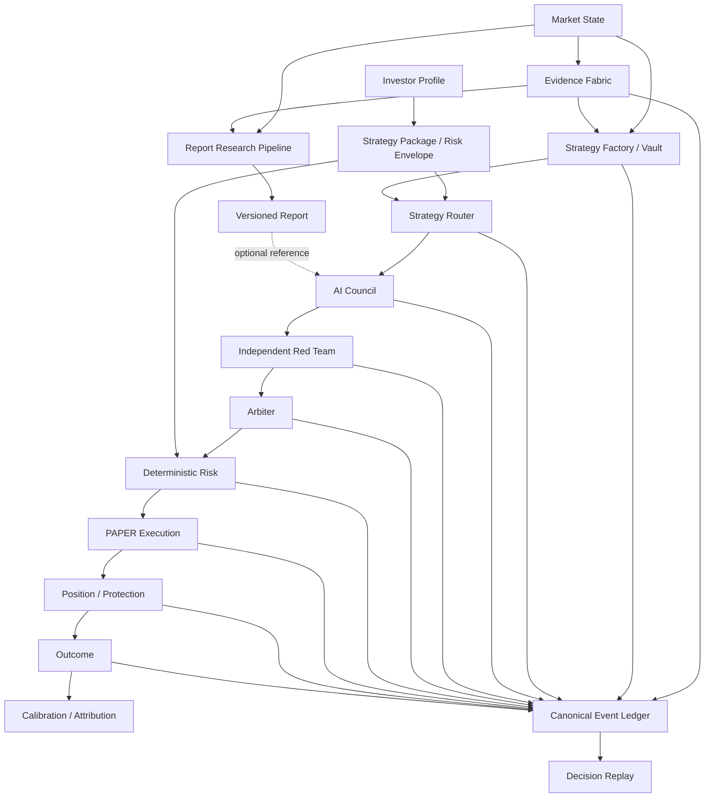

# BLACK ORACLE

**An auditable AI investment operating system - rebuilt around controlled automation, replayable decisions, and a clear mobile product experience.**

BLACK ORACLE connects market state, evidence, competing strategies, multi-agent review, deterministic risk, PAPER execution, and realized outcomes through one canonical decision lineage.

> **Market -> Evidence -> Strategies Compete -> Router -> Council -> Arbiter -> Risk -> Execution -> Outcome -> Learning**

The project is currently in active redesign and PAPER-stage development. Autonomous live-capital authority is **not** the current product claim.

---

## Product direction

BLACK ORACLE is being organized into two independent product modes.

### AutoTrade

AutoTrade is the execution-oriented investment engine.

It is designed to configure and operate a portfolio of strategies according to an investor's:

- risk tolerance,
- investment horizon,
- return objective,
- loss limits,
- intervention preference,
- and current market constraints.

Target flow:

```text
Investor Profile
  -> Strategy Package
  -> Market State + Evidence
  -> Strategy Factory / Vault
  -> Strategy Router
  -> AI Council
  -> Independent Red Team
  -> Arbiter
  -> Deterministic Risk
  -> PAPER Execution
  -> Position / Outcome
  -> Decision Replay / Calibration
```

AutoTrade is not a single-strategy signal bot. `LONG`, `SHORT`, and `NO_TRADE` are first-class decisions.

### Report

Report is an independent research and market-intelligence product.

Target flow:

```text
Market / Company / Asset
  -> Data + Evidence
  -> Research pipeline
  -> AI analysis
  -> Versioned Report
  -> Archive / Compare / Reference
```

Reports can be referenced from AutoTrade when useful, but Report is **not a mandatory execution gate** and does not silently authorize trades.

---

## Core principle: preserve the decision, not only the result

For every meaningful execution-side decision, BLACK ORACLE aims to preserve:

- the market state that existed at the time,
- the Evidence that was available,
- eligible and rejected strategies,
- Router selection and `NO_TRADE` reasoning,
- Council and Red Team analysis,
- Arbiter output,
- deterministic Risk decisions,
- order/fill/protection events,
- realized outcomes,
- and later calibration/attribution.

The system should be able to answer:

> **Why did this risk exist, what information was used, what could have invalidated it, and which layer added or destroyed value?**

---

## Canonical architecture



Missing data is represented explicitly as a data gap. It must never be fabricated to make the interface look complete.

---

## Authority model

BLACK ORACLE separates **intelligence** from **authority**.

1. New intelligence layers begin in `SHADOW`.
2. AI Council does not override deterministic Risk.
3. Strategy grades do not directly authorize execution.
4. Reports do not directly authorize execution.
5. Material strategy, sizing, risk, or execution-policy changes require an explicit version boundary.
6. Historical decisions are not rewritten using newer policy.
7. PAPER qualification and live-capital authority are separate stages.
8. Degraded data blocks unsafe new risk rather than inventing certainty.

---

## Strategy intelligence

The target strategy lifecycle is:

```text
IDEA
-> CANDIDATE
-> TESTED
-> REJECTED or CHALLENGER
-> SHADOW
-> CHAMPION_CANDIDATE
-> HUMAN / POLICY PROMOTION REVIEW
-> CHAMPION
-> DEGRADE / RETIRE
```

Validation can include, where statistically meaningful:

- out-of-sample and walk-forward performance,
- expectancy and payoff ratio,
- maximum drawdown,
- Sharpe / Sortino,
- Monte Carlo survival,
- regime stability,
- parameter robustness,
- sample size,
- calibration,
- execution sensitivity,
- data quality,
- reproducibility,
- and operational reliability.

BLACK ORACLE uses a credit-style grade vocabulary from `AAA+` through `F-`, but grades remain composite and hard-gated rather than cosmetic conversions of win rate.

---

## Product experience

The redesigned product is **mobile-first** and uses a global mode switch:

`AUTOTRADE | REPORT`

Design goals:

- institutional data discipline with consumer-grade clarity,
- premium fintech rather than cyberpunk decoration,
- one primary question per screen,
- full-page drill-down for deep work,
- explicit data freshness and degraded states,
- code-rendered charts and financial visuals,
- no mock values on production truth surfaces.

Existing mobile mockups remain visual references for tone while the information architecture is rebuilt around the new product model.

---

## Master development program

The canonical redesign roadmap is defined in:

**[BLACK ORACLE Master Sprint Plan v3](docs/BLACK_ORACLE_MASTER_PLAN_V3.md)**

Current program:

| Sprint | Scope |
| --- | --- |
| **S0** | System Audit & Reset |
| **S1** | Canonical Data Foundation |
| **S2** | New Mobile App Shell |
| **S3** | Markets & Evidence |
| **S4** | AutoTrade Core |
| **S5** | Strategy Factory & Router |
| **S6** | Council & Arbiter |
| **S7** | Risk & Execution |
| **S8** | Trade, Portfolio & Decision Replay |
| **S9** | Report Product |
| **S10** | Investor Profile & Personalization |
| **S11** | Lab & Validation |
| **S12** | Pricing, Credits & Entitlements |
| **S13** | Realtime, PWA & Notifications |
| **S14** | Production Hardening |

Each Sprint is completed through code, tests, real runtime contracts, degraded-state handling, mobile QA, deployment/preview verification, and explicit acceptance criteria.

---

## Legacy policy

The redesign is allowed to replace obsolete code and UI aggressively, but it does **not** treat historical truth as disposable.

Protected assets include:

- PAPER orders, fills, positions, and outcomes,
- canonical event history,
- Strategy versions and experiments,
- qualification cohorts,
- Evidence provenance,
- Council/Arbiter decisions where recorded,
- validation and Monte Carlo outputs,
- runtime incidents,
- calibration observations.

Legacy navigation, duplicate dashboards, obsolete demo data, old mobile entrypoints, stale Firebase-era assumptions, and abandoned stacked implementations may be retired after dependency review and replacement parity.

**Preserve truth; replace obsolete presentation and orchestration.**

---

## Current implementation foundations

The repository already contains substantial foundations, including:

- Strategy Factory and Strategy Router concepts,
- deterministic risk and PAPER execution paths,
- AI Council / Red Team / Arbiter architecture,
- canonical event and replay concepts,
- Evidence/NARS integration work,
- crypto and KRX PAPER infrastructure,
- experiment and Monte Carlo utilities,
- mobile product iterations,
- Railway-oriented deployment packaging.

The current redesign focuses on consolidating these into one coherent architecture instead of continuing parallel product versions.

---

## Quick start

### Requirements

- Node.js 22+
- npm

### Install

```bash
git clone https://github.com/hanul442/Black-oracle.git
cd Black-oracle
npm install
cp .env.example .env
```

Never commit API keys, broker credentials, or Supabase service-role secrets.

### Development

```bash
npm run dev
```

Trading development:

```bash
npm run dev:trading
```

### Verification

```bash
npm run lint
npm run test:trading
npm run smoke:trading
npm run build
```

---

## Technology

Current repository foundations include:

- React 19 + TypeScript
- Vite
- Tailwind CSS
- Node.js / Express
- Supabase-backed durable state and canonical storage
- server-side AI model routing
- D3 / Recharts / custom financial visualizations
- Railway-oriented production deployment

Some legacy dependencies may remain temporarily during migration and should not be interpreted as target architecture.

---

## Governance

- [Product Constitution v1](docs/BLACK_ORACLE_PRODUCT_CONSTITUTION_V1.md)
- [Master Sprint Plan v3](docs/BLACK_ORACLE_MASTER_PLAN_V3.md)
- [Open Core Boundary](docs/OPEN_CORE_BOUNDARY.md)
- [Contributing](CONTRIBUTING.md)
- [Security](SECURITY.md)

---

## Disclaimer

BLACK ORACLE is experimental research and software infrastructure. It is **not financial advice**, does not guarantee profitability, and should not be treated as evidence that PAPER or historical results will transfer to live markets.

Any future real-capital authority requires separate credentials, policies, validation gates, capital limits, incident procedures, and explicit rollout approval.

---

## License

Licensed under the **Apache License 2.0**. See [LICENSE](LICENSE).

<p align="center"><strong>BLACK ORACLE</strong><br/>Evidence in. Decisions traced. Outcomes learned.</p>
