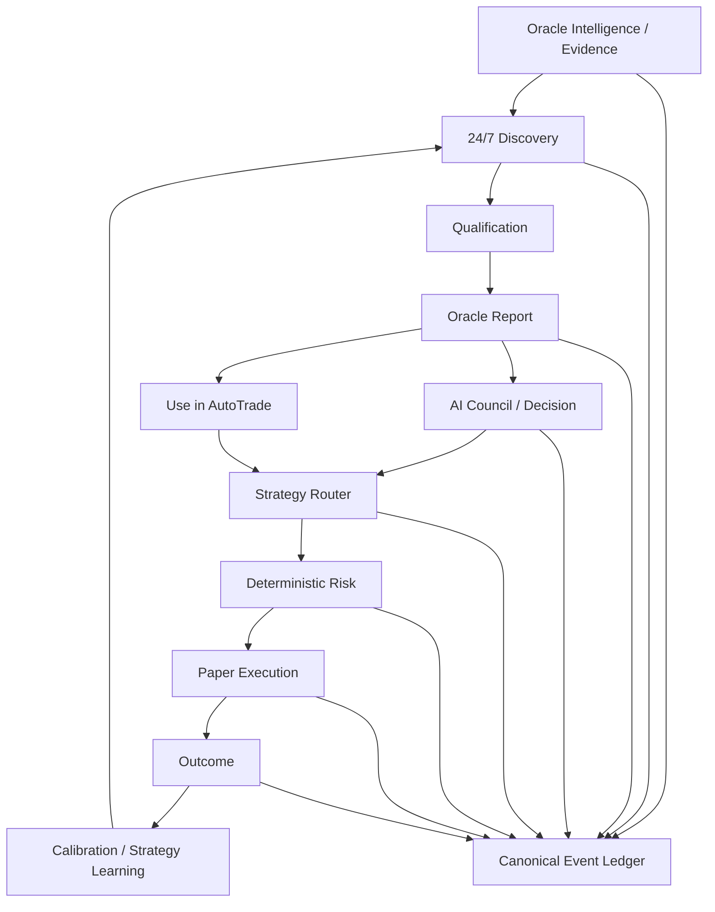

# BLACK ORACLE

**AI Investment Research & Automated Trading Platform**

BLACK ORACLE is an experimental platform for discovering investment opportunities, explaining them through auditable AI research, validating competing strategies, and turning qualified decisions into automated **PAPER** trades.

> **Research opportunities. Build and rank strategies. Turn validated decisions into automated trades.**

The product is being redesigned around two primary experiences and one supporting network layer:

- **REPORT** — discover, search, analyze, and monitor stocks, crypto assets, sectors, and themes.
- **AUTOTRADE** — build, validate, rank, modify, fork, and run strategies.
- **COMMUNITY** — share reports, strategies, experiments, and forks around validated objects rather than generic market chatter.

Under the product surface remains the system's original core advantage: every material decision should remain traceable from the information available at the time through strategy, Council, Risk, execution, and outcome.

**Current stage:** Beta 1.0 product migration · active PAPER qualification · no production-live autonomous capital authority.

---

## Product model

### REPORT

REPORT answers:

- What is worth looking at now?
- Why is a sector, stock, or crypto asset interesting?
- What evidence supports or contradicts the thesis?
- What do the AI Council members think?
- What are the entry zone, stop, targets, expected scenarios, and invalidation conditions?

Target REPORT capabilities include:

- sector/theme discovery
- stock and crypto search
- recent and updated reports
- watchlists
- evidence-backed thesis
- interactive Council
- Bull / Base / Bear forecasts
- visual chart analysis
- ENTRY / SL / TP overlays
- immutable report versions
- `Use in AutoTrade` handoff

A Report is not intended to be a static PDF. It is a versioned investment decision object backed by canonical evidence and forecast history.

### AUTOTRADE

AUTOTRADE answers:

- Which strategies are strongest right now?
- How were they validated?
- Can I run, modify, compare, or fork them?
- How much risk should they receive?
- What trades and positions are they currently producing?

Target AUTOTRADE surfaces include:

- Strategy Rank
- official / AI / user / forked strategies
- natural-language strategy builder
- visual rule builder
- advanced code/DSL path
- AI Strategy Factory / Incubator
- validation pipeline
- Marketplace
- PAPER Portfolio
- Positions / Trades
- Decision Replay

Strategies compete under a common validation framework instead of a simple return leaderboard.

### COMMUNITY

Community is intentionally strategy/report-centric.

Beta direction:

- Trending Strategies
- Trending Reports
- Experiments
- Fork Activity
- Comments
- Creator profiles

The goal is not to build a generic stock message board. Community should help research and strategies evolve.

---

## One engine underneath

REPORT and AUTOTRADE are separate product experiences backed by one canonical decision graph.



`LONG`, `SHORT`, and `NO_TRADE` remain first-class decisions.

A new product surface must not create a second truth for a decision that already exists in canonical lineage.

---

## Why BLACK ORACLE exists

Most investment apps optimize one layer:

- information,
- charting,
- recommendations,
- backtesting,
- or execution.

BLACK ORACLE is being built around the full loop:

> **Evidence → Discovery → Report → Council → Strategy → Risk → Trade → Outcome → Learning**

The system should eventually be able to answer, for any material trade or rejected opportunity:

- what the market looked like,
- which evidence was available,
- why the opportunity was discovered,
- which strategies were eligible or rejected,
- what independent Council agents believed,
- what challenged the thesis,
- what deterministic Risk allowed or blocked,
- what order/fill occurred,
- what happened afterward,
- and which layer added or destroyed value.

The goal is not an AI that merely says **BUY** or **SELL**.

---

## Strategy Rank and validation

Official Oracle strategies, AI-generated strategies, user strategies, and forks are intended to compete under the same validation rules.

The shared grade vocabulary runs from `AAA+` through `F-`, but grades are composite and hard-gated rather than cosmetic conversions of return or win rate.

Where sample quality permits, validation considers:

- out-of-sample / walk-forward performance
- expectancy and payoff ratio
- max drawdown
- Sharpe / Sortino
- Monte Carlo survival
- regime stability
- parameter robustness
- transaction-cost sensitivity
- sample quality
- execution robustness
- operational reliability

Target lifecycle:

```text
IDEA
→ CANDIDATE
→ BACKTEST
→ WALK-FORWARD / OOS
→ MONTE CARLO / REGIME STRESS
→ SHADOW
→ PAPER
→ CHALLENGER
→ HUMAN/POLICY PROMOTION
→ CHAMPION
→ DEGRADE / RETIRE
```

AI may generate and mutate strategies. It may not silently grant them higher execution authority.

---

## Forkable strategies

A core Beta 1.0 direction is to make strategies modifiable objects with explicit lineage.

Example:

```text
Oracle Momentum v14
        │
        ├── AI Mutation #81
        │
        ├── Hanseo Momentum v1
        │       └── Hanseo Momentum v2
        │
        └── Community Fork #381
```

Users should eventually be able to:

- run the original in PAPER,
- fork it,
- modify rules with AI,
- change universe/risk/execution parameters,
- re-run qualification,
- compare the fork with the parent,
- and compete in Strategy Rank.

Beta Marketplace starts as validated discovery, Paper Run, compare, follow, and fork infrastructure. Paid strategy transactions are a later phase.

---

## Oracle Intelligence

The existing NARS/Evidence direction is being generalized into **Oracle Intelligence**.

Long-term ingestion should support extensible sources such as:

- news
- filings
- market data
- research
- macro data
- on-chain data
- PDFs / CSVs
- APIs / databases
- custom scrapers/connectors
- future enterprise-private sources

The design objective is broader than financial news: the same evidence model should eventually support B2B intelligence workflows with tenant and permission boundaries.

---

## AI Council

Council remains a decision layer, not decorative AI personas.

Beta 1.0 product direction uses a professional Council experience with stable analytical roles plus dynamic specialist participation where relevant.

Initial opinions should be independently committed before debate to reduce herding and anchoring. The system can then perform structured challenge, evidence re-check, and weighted synthesis.

Specialists may include domains such as:

- on-chain
- crypto microstructure
- options
- earnings
- Elliott Wave
- Korean institutional flow

Specialist access can later be controlled by subscription entitlements or Oracle Credits.

Council never bypasses deterministic Risk.

---

## Decision lineage and Replay

The append-oriented canonical audit layer remains a core technical moat.

Relevant event families include:

- `EVIDENCE`
- `STRATEGY`
- `RISK`
- `ORDER`
- `TRADE`
- `OUTCOME`
- `SYSTEM`

Decision Replay reconstructs the path around a decision and its outcome.

In Beta 1.0, Replay is productized inside Report history and Trade detail instead of requiring users to understand a separate ledger application.

Historical forecasts and decisions are not retrospectively rewritten after outcomes become known.

---

## Current implemented foundation

The repository already contains substantial parts of the underlying engine, including:

- Strategy Factory and strategy candidate lifecycle
- Strategy Router
- Challenger / Shadow concepts
- Monte Carlo and validation utilities
- deterministic Risk / execution policy
- AI Council / challenge / synthesis architecture
- Canonical Event Ledger
- NARS / Evidence projections
- Decision Replay and calibration primitives
- crypto PAPER runtime
- KRX equity PAPER path
- runtime integrity and fault-tolerance work
- mobile financial-data surfaces

Beta 1.0 therefore focuses heavily on **productization, integration, navigation, and commercial layers** rather than replacing validated infrastructure without cause.

See [`docs/BETA_1_0_MIGRATION_MAP.md`](docs/BETA_1_0_MIGRATION_MAP.md) for the migration classification.

---

## Safety and authority model

BLACK ORACLE treats execution authority as something that must be earned by evidence.

1. New authority begins in `SHADOW`.
2. Deterministic Risk remains sovereign.
3. Missing data is displayed as missing, never invented for presentation.
4. Strategy, risk, sizing, or execution semantics are never silently changed inside an existing qualification cohort.
5. Historical decisions and forecasts are not rewritten as if newer logic had existed.
6. Promotion is hard-gated by prospective evidence, not a polished UI or one profitable period.
7. PAPER → real capital requires explicit staged validation and rollback rules.
8. Community or Marketplace popularity never grants trading authority.

Beta 1.0 remains PAPER-only.

---

## Product navigation target

The Beta 1.0 user-facing information architecture is:

```text
HOME

REPORT
├── Discover
├── Search
├── Recent
├── Watchlist
└── Report Detail

AUTOTRADE
├── Strategy Rank
├── Strategies
├── Builder / Fork / Modify
├── AI Incubator
├── Marketplace
├── Portfolio
├── Positions
└── Trades / Replay

COMMUNITY
├── Trending Strategies
├── Trending Reports
├── Experiments
├── Fork Activity
└── Discussions / Profiles
```

Engineering concepts such as Router, Arbiter, System, Ledger, Monte Carlo, or raw NARS internals remain available where useful for advanced inspection but are not automatically top-level product navigation.

---

## Product plans — working direction

Planned product tiers:

- **Oracle**
- **Oracle+**
- **Oracle Pro**
- **Oracle Enterprise**

The commercial model is expected to combine subscriptions with Oracle Credits for high-cost workloads such as specialist calls, deep Council reruns, large simulations, or heavy research tasks.

Current working price hypotheses are not final pricing commitments:

- Oracle — KRW 24,900 / month
- Oracle+ — KRW 79,000 / month
- Oracle Pro — KRW 249,000 / month
- Oracle Enterprise — from approximately KRW 1,490,000 / month plus data/compute/seats

Actual pricing should be recalibrated from measured Beta COGS, data licensing, support cost, product value, and usage patterns.

---

## Quick start

### Requirements

- Node.js 22+
- npm

### Install

```bash
git clone https://github.com/hanul442/Black-oracle.git
cd Black-oracle
npm install
cp .env.example .env
```

Use placeholder/local-safe values in `.env`. Never commit API keys or Supabase service-role credentials.

### Development

```bash
npm run dev
```

Trading development entrypoint:

```bash
npm run dev:trading
```

### Validation

```bash
npm run lint
npm run test:trading
npm run smoke:trading
npm run build
```

---

## Technology

Current repository dependencies/runtime include:

- React 19 + TypeScript
- Vite
- Tailwind CSS
- Node.js / Express
- Supabase-backed durable trading state and canonical event storage
- server-side AI model routing
- D3 / Recharts / custom visualizations
- Railway-oriented production packaging

Beta 1.0 may refactor the stack where justified, but product requirements and migration safety should drive those decisions rather than technology churn for its own sake.

---

## Governance and architecture

- [`docs/BLACK_ORACLE_PRODUCT_CONSTITUTION_V2.md`](docs/BLACK_ORACLE_PRODUCT_CONSTITUTION_V2.md) — Beta 1.0 product source of truth
- [`docs/BETA_1_0_MIGRATION_MAP.md`](docs/BETA_1_0_MIGRATION_MAP.md) — legacy → Beta 1.0 migration map
- [`docs/BLACK_ORACLE_PRODUCT_CONSTITUTION_V1.md`](docs/BLACK_ORACLE_PRODUCT_CONSTITUTION_V1.md) — historical baseline and preserved authority invariants
- [`docs/BLACK_ORACLE_MASTER_PLAN_V2.md`](docs/BLACK_ORACLE_MASTER_PLAN_V2.md) — existing engine development program
- [`docs/OPEN_CORE_BOUNDARY.md`](docs/OPEN_CORE_BOUNDARY.md) — public project vs private Alpha boundary
- [`CONTRIBUTING.md`](CONTRIBUTING.md) — contribution workflow and safety constraints
- [`SECURITY.md`](SECURITY.md) — vulnerability reporting

---

## Important disclaimer

BLACK ORACLE is experimental research and software infrastructure. It is **not financial advice**, does not guarantee profitability, and should not be treated as evidence that any strategy will perform similarly in live markets.

Current development is centered on PAPER qualification, product migration, traceability, validation, and runtime safety. Any future live-capital authority requires separate credentials, policies, capital limits, validation gates, staged rollout, and rollback procedures.

---

## License

Licensed under the **Apache License 2.0**. See [`LICENSE`](LICENSE).

The license applies to code and documentation published in this repository. Private Alpha, credentials, private datasets, and non-public production configuration are outside this repository and are not made public by this license.

---

<p align="center"><strong>BLACK ORACLE</strong><br/>Research clearly. Validate rigorously. Automate carefully.</p>
