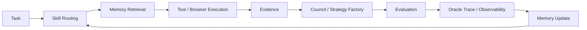

# Cycle 014 — BLACK ORACLE Agent OS External Reference Review

> **Review date:** 2026-09-23  
> **Status:** REVIEWED  
> **Decision:** MIXED — ADOPT PATTERN / TEST / REFERENCE  
> **Scope:** Agent Architecture · Memory · Tool Execution · Quant R&D · Design System · LLM Observability  
> **Reference intake:** [REF-PROD-002](../../references/product/agent-os-rnd-reference-bundle-2026-09-23.md)

## Executive decision

이번 레퍼런스 묶음에서 가장 중요한 발견은 개별 라이브러리 하나가 아니다. BLACK ORACLE이 앞으로 고도화될수록 필요한 것은 더 큰 시스템 프롬프트가 아니라, **기억하고, 필요한 전문 절차를 불러오고, 외부 도구를 사용하고, 근거를 남기고, 자신의 동작을 추적하는 Agent Operating System**에 가깝다.

현재 BLACK ORACLE에는 이미 NARS, Evidence, Council, Strategy Factory, Router, Experiment Ledger, Champion–Challenger 등 주요 기능 축이 존재한다. 문제는 이 기능들이 각각 존재하는 것과 장기간 일관된 실행 규율 아래에서 결합되는 것은 별개의 문제라는 점이다. 이번 레퍼런스들은 이 간극을 메우는 데 공통된 힌트를 준다.

권고하는 기본 실행 루프는 다음과 같다.



이 구조에서 NARS는 세상을 읽고, Skills는 일하는 방법을 규정하고, Memory는 과거의 학습을 보존한다. Tool/Browser 계층은 필요한 외부 행동을 수행하고, Evidence는 사실과 출처를 고정한다. Council과 Strategy Factory는 판단과 가설을 생산하며, Evaluation과 Observability가 그 판단이 실제로 얼마나 잘 작동했는지를 측정한다. 마지막으로 결과를 Memory와 Experiment Ledger에 환류시키면 하나의 학습 루프가 완성된다.

| Reference | Decision | BLACK ORACLE application |
|---|---|---|
| Scientific Agent Skills | **ADOPT PATTERN / TEST IMPLEMENTATION** | BO Skill Registry |
| AgentMemory | **ADOPT PATTERN / TEST IMPLEMENTATION** | Agent Memory Layer |
| Browser Use | **TEST** | NARS / research fallback executor |
| VWAP deviation | **TEST ONLY** | Strategy Factory research hypothesis |
| Design-skill ecosystem | **REFERENCE / TEST** | BO Design Pipeline |
| HeroUI v3 | **POC → ADOPT CANDIDATE** | UI foundation + agent-readable component source of truth |
| Datadog Agent Observability | **ADOPT PATTERN / TEST IMPLEMENTATION** | Oracle Trace / evaluation telemetry |

---

## 1. Scientific Agent Skills — 프롬프트가 아니라 절차를 모듈화한다

K-Dense의 **Scientific Agent Skills**는 2026년 9월 현재 166개의 연구·과학 스킬을 공개하고 있으며, 개별 스킬은 `SKILL.md`를 중심으로 사용 시점, 워크플로, 예제, 참조자료와 필요한 경우 스크립트를 묶는다. 저장소는 open Agent Skills 표준을 따르며 Cursor, Claude Code, Codex 등 여러 에이전트 환경에서 사용할 수 있도록 구성되어 있다. 버전 핀ning, 테스트, 보안 스캔 같은 운영 규율도 함께 제시한다.

- Source: https://github.com/K-Dense-AI/scientific-agent-skills
- Skills catalog: https://github.com/K-Dense-AI/scientific-agent-skills/blob/main/docs/skills.md

BLACK ORACLE에 중요한 것은 과학 스킬 자체보다 **procedural knowledge를 호출 가능한 단위로 만든 구조**다. BO는 이미 분석 규칙이 빠르게 늘어나는 단계에 있다. 예를 들어 Council이 어떤 반론을 반드시 검토해야 하는지, Evidence가 어떤 신선도·출처 조건을 충족해야 하는지, Strategy Factory가 어떤 검증을 거쳐야 하는지, 특정 자산군에서 어떤 microstructure 검사를 수행해야 하는지는 모두 장기적으로 시스템 프롬프트에 계속 누적하기 어려운 종류의 지식이다.

따라서 BO에서는 다음과 같은 Skill Registry가 자연스럽다.

- `equity-fundamental-analysis`
- `macro-regime-analysis`
- `crypto-market-structure`
- `evidence-verification`
- `strategy-backtest-review`
- `council-red-team`
- `execution-cost-review`
- `risk-boundary-check`

핵심은 항상 모든 스킬을 모델 컨텍스트에 넣는 것이 아니다. 작업을 먼저 분류하고 필요한 절차만 로드해야 한다. SK하이닉스 기업분석에는 equity, semiconductor, evidence 계열이 들어가고, BTC 단기전략 검증에는 crypto, market-structure, execution-cost, risk 계열이 들어가는 식이다. 이런 구조는 컨텍스트 낭비를 줄이고, 특정 절차가 언제 적용되었는지 추적하기 쉽게 만든다.

다만 K-Dense 저장소 전체를 그대로 가져오는 것은 권하지 않는다. 도메인 대부분이 생명과학·의학 중심이고, 외부 스킬은 공급망 위험과 버전 변화도 존재한다. BO가 가져와야 하는 것은 **스킬 시스템의 운영 방식**이다. 실제 BO Skill은 금융·증거·실행 안전 요구에 맞춰 별도로 작성하고, 버전·출처·테스트·권한을 명시해야 한다.

**Decision:** 구조는 채택. 구현은 별도 PoC.

---

## 2. AgentMemory — 대화 로그가 아니라 기억의 구조를 만든다

AgentMemory는 coding agent를 위한 local-first memory layer다. 장기 기억, daily log, scratchpad, topic 단위 저장을 Markdown으로 관리하고, 선택적으로 qmd 검색을 사용한다. 또한 MCP 서버로 노출할 수 있어 다른 에이전트가 동일한 기억 계층을 호출하도록 만들 수 있다.

- Source: https://github.com/jayzeng/agentmemory

여기서 BO에 유용한 포인트는 **Markdown이 source of truth이고 검색 인덱스는 retrieval layer라는 원칙**이다. 벡터 DB나 임베딩 검색이 기억 자체가 되는 것이 아니라, 사람이 읽고 diff하고 백업할 수 있는 canonical memory가 존재하고 검색은 그것을 찾아주는 역할만 한다.

BLACK ORACLE에는 이미 Evidence Ledger와 Experiment Ledger가 있다. 그러나 이것들은 시장과 실험의 기억이지, 에이전트의 운영 기억 전체는 아니다. 별도의 Agent Memory Layer가 있다면 다음과 같이 나눌 수 있다.

**Decision Memory**는 중요한 제품·모델·전략 선택과 그 이유를 저장한다. **Failure Memory**는 반복되는 모델 오류, 데이터 오류, 잘못된 도구 사용, 잘못된 가정을 기록한다. **Experiment Memory**는 어떤 가설을 언제 어떻게 시험했고 왜 채택·기각했는지 요약한다. **Product Memory**는 BLACK ORACLE의 디자인 원칙, 사용자 흐름, 금지된 패턴과 인터랙션 정책을 보존한다.

이렇게 하면 에이전트가 매번 과거 대화를 통째로 검색하는 대신 현재 작업에 필요한 기억만 회수할 수 있다. 예를 들어 새로운 Strategy Factory 실험을 시작할 때 과거 유사 전략의 실패 이유와 검증 누락을 자동으로 불러오는 방식이다.

하지만 AgentMemory 프로젝트 자체를 production memory backend로 바로 채택해서는 안 된다. 금융 시스템에서는 권한, retention, provenance, deletion, secret handling, immutable evidence와 editable memory의 분리 등이 더 중요하다. 따라서 **local-first, inspectable memory pattern은 채택하되 구현체는 테스트 대상으로만 사용**한다.

**Decision:** 개념 채택, 구현체 실험.

---

## 3. Browser Use — 기본 데이터 수집기가 아니라 제한된 fallback executor

Browser Use API v4는 자연어 task를 받아 클라우드 브라우저에서 실제 웹 작업을 수행하고 텍스트 또는 schema-validated JSON 결과를 반환한다. 로그인 profile, 파일, 프록시 국가, 세션 유지, live view 같은 기능도 제공한다.

- Source: https://browser-use.com/web-agent-api
- Developer overview: https://browser-use.com/developers

이 기능을 BO의 범용 데이터 수집기로 사용하는 것은 권하지 않는다. 가격, 공시, 뉴스 메타데이터, 거시지표처럼 정형 API나 안정적인 feed가 존재하는 정보는 deterministic path가 우선이어야 한다. 브라우저 agent는 느리고 비용이 들며 웹 UI 변화에 민감하고, 같은 작업의 재현성도 API보다 낮다.

대신 NARS나 Research Executor가 **정형 경로로 처리하기 어려운 마지막 구간**에서 사용하면 가치가 크다. 예를 들어 기업 IR 사이트에 들어가 최신 PDF를 찾고, 다운로드 링크를 추출하고, 특정 표가 존재하는지 확인하는 작업처럼 클릭과 탐색이 필요한 경우다. 또는 거래소·기관 웹페이지에서 JavaScript 렌더링 뒤에 나타나는 내용을 확인해야 하는 경우도 해당된다.

권한은 반드시 제한해야 한다. 초기 PoC는 read-only profile, allowlisted domain, 다운로드 파일 격리, no credential write, no financial action을 기본값으로 두는 것이 맞다. Browser Use가 확보한 결과 역시 바로 사실로 승격하지 않고 Evidence pipeline을 통과해야 한다.

**Decision:** 제한적 테스트. API-first / browser-fallback 원칙 유지.

---

## 4. VWAP deviation — 아이디어는 채택하되 전략으로는 채택하지 않는다

스크린샷에서 제시된 질문은 단순하다. “VWAP에서 어느 정도 벗어났을 때 deviation이 실제 trading edge가 되는가?” 이 질문 자체는 Strategy Factory가 다루기 좋은 형태다. 중요한 것은 이를 곧바로 매수·매도 규칙으로 받아들이지 않는 것이다.

2026년 SSRN에 게시된 한 연구는 previous-session extremes, VWAP deviation, ADX momentum exhaustion을 결합한 FX mean-reversion framework를 제안한다. 그러나 해당 논문은 **formal backtesting과 performance attribution을 future work로 남긴다.** 즉 개념적 근거는 있지만 성과가 검증된 전략으로 취급할 수 없다.

- Source: https://papers.ssrn.com/sol3/papers.cfm?abstract_id=6454659

따라서 BO에서는 다음과 같이 처리하는 것이 맞다.

`Hypothesis: sufficiently large, regime-conditioned VWAP deviation contains conditional mean-reversion information.`

이 가설을 NASDAQ, BTC, KOSPI/KRX 등 서로 다른 시장에서 session definition, volatility regime, trend strength, volume regime, deviation normalization, holding horizon을 바꿔 시험한다. 수수료와 slippage를 포함하고, purged/embargoed temporal validation과 OOS 구간을 사용하며, 여러 threshold를 탐색할 경우 multiple-testing accounting도 필요하다.

특히 “VWAP ± 2σ” 같은 숫자는 그 자체로 edge가 아니다. threshold를 사후 최적화하면 쉽게 overfit된다. 따라서 이 아이디어의 가치는 **전략 후보**가 아니라 **검증 가능한 research hypothesis**라는 데 있다.

**Decision:** Strategy Factory TEST ONLY. 성과 검증 전 어떠한 promotion도 금지.

---

## 5. Design Skills — AI가 화면을 만들기 전에 디자인 규율을 불러온다

스크린샷에서 확인된 Design Taste, Frontend Design, UI UX Pro Max, Impeccable, Design Motion Principles 같은 카드들은 최근 AI coding workflow가 단순 코드 생성에서 **design judgment를 skill로 모듈화하는 방향**으로 움직이고 있음을 보여준다. 공개 구현 중 UI/UX Pro Max는 스타일, 팔레트, 폰트 조합, UX 가이드라인과 chart pattern을 검색 가능한 형태로 제공하고, Impeccable은 product/design context와 deterministic detector를 이용해 AI-generated frontend의 반복적인 안티패턴을 점검한다.

- UI/UX Pro Max: https://github.com/nextlevelbuilder/ui-ux-pro-max-skill
- Impeccable: https://github.com/pbakaus/impeccable

여기서 중요한 것은 스킬을 많이 설치하는 것이 아니다. BO에서 가장 위험한 실패는 서로 다른 디자인 스킬이 각자 다른 미학을 주입해 화면마다 디자인 언어가 바뀌는 것이다. 따라서 **BLACK ORACLE Product Constitution과 Design Contract가 상위 규칙**이어야 하고, 외부 skill은 특정 단계의 보조 역할만 맡아야 한다.

권고하는 디자인 파이프라인은 다음과 같다.

`Product Truth → BO Design Contract → Pattern Search → Composition → Implementation → Critique → Accessibility / Motion / Responsive Audit → Ship`

UI/UX Pro Max 계열은 pattern search와 후보 탐색에 쓰고, frontend-design 계열은 composition과 implementation에 쓰며, Impeccable 계열은 critique와 polish 단계에 사용하는 식으로 역할을 분리한다. 이렇게 하면 “예쁜 화면을 만들어라”는 모호한 요구를 반복하는 대신, 어떤 단계에서 어떤 종류의 판단을 해야 하는지가 명확해진다.

스크린샷에 나타난 특정 Stage marketplace package의 정확한 패키지 정체성은 이번 조사에서 독립적으로 확인하지 않았다. 따라서 해당 화면은 **생태계 방향성을 보여주는 discovery reference**로만 취급한다.

**Decision:** 외부 design-skill ecosystem은 REFERENCE / TEST. BO Design Contract를 대체하지 않는다.

---

## 6. HeroUI v3 — 컴포넌트 라이브러리보다 ‘AI가 이해할 수 있는 디자인 시스템’이 핵심이다

HeroUI v3는 2026년 3월 ground-up rewrite로 공개되었다. 공식 문서 기준 React web에 75개 이상의 컴포넌트, React Native에 37개 컴포넌트를 제공하며, React Aria 기반 접근성, Tailwind CSS v4, CSS variable 기반 theming, compound component architecture를 핵심으로 한다. 2026-09-17 기준 최신 React 릴리스는 **v3.2.6**이다.

- v3 announcement: https://heroui.com/en/docs/react/releases/v3-0-0
- v3.2.6: https://heroui.com/en/docs/react/releases/v3-2-6

BO 관점에서 더 흥미로운 부분은 HeroUI가 **AI-assisted development를 라이브러리의 공식 인터페이스로 취급한다는 점**이다. HeroUI는 React MCP server를 제공해 coding agent가 component docs, props, source code, CSS styles, theme variables를 직접 조회할 수 있게 하고, `llms.txt`, `llms-components.txt`, `llms-patterns.txt` 같은 machine-readable documentation도 제공한다.

- MCP: https://heroui.com/en/docs/react/getting-started/mcp-server
- LLMs.txt: https://heroui.com/en/docs/react/getting-started/llms-txt

이 구조는 BO에 잘 맞는다. AI가 기억에 의존해 잘못된 component API를 생성하는 대신 최신 source of truth를 조회하게 할 수 있기 때문이다. 특히 BLACK ORACLE을 AI coding workflow로 지속적으로 개발한다면 “디자인 시스템이 인간에게만 문서화되어 있는가, agent에게도 읽히는가”가 실제 생산성 차이를 만든다.

그러나 기존 UI 전체를 HeroUI로 즉시 migration하는 것은 권하지 않는다. 먼저 신규 surface 하나를 골라 thin-slice PoC를 하는 것이 맞다. 후보는 Evidence drawer, Council panel, Strategy card, report shell처럼 독립된 기능이 좋다.

권고 계층은 다음과 같다.

`BO Design Tokens → HeroUI Primitives → BO Components → Product Screens`

HeroUI 기본 외관을 BLACK ORACLE의 디자인으로 착각해서는 안 된다. HeroUI는 구현 substrate이고, BO의 white/ivory/gold 또는 향후 확정된 canonical visual language가 최상위 표현 규칙이다.

PoC에서 확인할 항목은 accessibility, theming fidelity, bundle/runtime cost, compound component ergonomics, mobile responsiveness, agent-generated code correctness, migration friction이다.

**Decision:** 좁은 PoC 후 채택 여부 결정. 현재는 ADOPT CANDIDATE.

---

## 7. Datadog Agent Observability — 모델을 평가하는 것이 아니라 전체 실행을 추적한다

Datadog Agent Observability는 LLM/agent request를 trace와 span으로 표현하고 latency, errors, token usage, cost, prompt metadata 및 평가 결과를 연결한다. Prompt Tracking은 prompt template/version을 실제 trace에 연결해 버전별 호출량, latency, token usage, cost를 비교할 수 있게 한다. 품질·안전 측면에서는 failure-to-answer, prompt injection, hallucination 등 agent-specific evaluation을 운영하는 방향을 보여준다.

- Agent Observability: https://docs.datadoghq.com/llm_observability/
- Prompt Tracking: https://docs.datadoghq.com/llm_observability/instrument/prompt_tracking/

BLACK ORACLE에서는 이 패턴을 **Oracle Trace**로 번역할 가치가 크다. Model Router와 Champion–Challenger가 존재해도 “어떤 변경이 실제 개선을 만들었는지”를 연결할 수 없다면 운영은 결국 감각에 의존하게 된다.

최소한 하나의 `run_id` 아래 다음 정보가 연결되어야 한다.

- model/provider/version
- prompt / system-policy version
- skills loaded
- memory references
- evidence IDs / snapshot IDs
- tool calls and tool outcomes
- latency
- token usage / estimated cost
- Council outputs and disagreements
- strategy / decision artifact
- evaluation result
- eventual market / execution outcome where applicable

여기서 중요한 경계는 **observability vendor가 canonical truth가 되어서는 안 된다는 것**이다. BO의 trace identity와 evidence lineage는 BO-owned schema여야 하며 Datadog, OpenTelemetry 또는 다른 backend는 adapter여야 한다. 그래야 vendor를 바꿔도 Experiment Ledger와 replay chain이 깨지지 않는다.

Experiment Ledger는 “무엇을 시험했는가”를 기록하고 Oracle Trace는 “실제 시스템이 어떻게 행동했는가”를 기록한다. 둘이 연결되면 `change → deploy/test → trace → outcome → evaluation → adopt/rollback` 루프를 만들 수 있다.

**Decision:** observability pattern 채택. BO-canonical trace schema로 구현 검토.

---

## 8. 통합 해석 — BLACK ORACLE을 Agent OS로 본다

이번 레퍼런스는 서로 다른 분야처럼 보이지만 한 방향을 가리킨다.

Scientific Agent Skills는 **어떻게 일할지**를 외부화한다. AgentMemory는 **무엇을 기억할지**를 분리한다. Browser Use는 **어떻게 행동할지**를 확장한다. VWAP reference는 **아이디어를 바로 전략으로 만들지 않고 검증 가능한 가설로 바꾸는 방법**을 보여준다. Design Skills는 **AI의 미학적 판단을 통제 가능한 workflow로 만든다.** HeroUI는 **디자인 시스템 자체를 agent-readable하게 만든다.** Agent Observability는 이 모든 실행이 실제로 어떻게 작동했는지를 **traceable system**으로 만든다.

따라서 BLACK ORACLE의 다음 아키텍처 레이어는 새로운 “super-agent” 하나가 아니라 다음의 느슨하게 결합된 계층으로 보는 것이 더 적절하다.

```text
NARS / Data Sources
        ↓
Task & Context Resolver
        ↓
Skill Registry
        ↓
Memory Retrieval
        ↓
Tool / Browser / Data Executors
        ↓
Evidence Store
        ↓
Council / Strategy Factory / Router
        ↓
Risk & Validation Gates
        ↓
Decision / No-Trade / Experiment Output
        ↓
Oracle Trace + Outcome Attribution
        ↓
Experiment Ledger + Memory Update
```

이 구조는 기존 BLACK ORACLE을 갈아엎는 방향이 아니다. 오히려 지금까지 만든 NARS, Evidence, Council, Strategy Factory, Champion–Challenger, Experiment Ledger가 **어떤 실행 규율 아래 연결되는지 정의하는 상위 orchestration layer**다.

---

## 9. 권고 PoC 순서

이번 리서치가 기존 Foundation Closure와 validation work보다 우선되어서는 안 된다. 따라서 구현 우선순위는 제한한다.

### C14-P1 — BO Skill Registry thin slice

`evidence-verification`과 `council-red-team` 두 개의 skill만 만든다. 같은 evaluation fixture에서 skill 사용 전후의 omission, policy violation, latency, token cost를 비교한다.

### C14-P2 — Agent Memory sandbox

Decision / Failure / Experiment 세 memory class만 정의한다. immutable Evidence와 editable Memory를 물리적으로 분리하고, retrieval이 잘못된 과거 기억을 과신하지 않는지 테스트한다.

### C14-P3 — Browser fallback sandbox

정형 API로 해결 가능한 task와 browser-only task를 분리해 테스트한다. Browser executor는 allowlist, read-only, no credential mutation으로 제한한다.

### C14-P4 — HeroUI v3 UI thin slice

기존 화면 전체 migration 없이 하나의 신규 component cluster만 구현한다. BO tokens, accessibility, mobile behavior, AI coding correctness를 측정한다.

### C14-P5 — Oracle Trace schema draft

새 vendor를 먼저 붙이지 않는다. 현재 Council/Router/Experiment Ledger가 필요로 하는 canonical trace envelope를 먼저 정의하고 이후 외부 observability backend를 adapter로 연결한다.

### C14-P6 — VWAP deviation hypothesis

Strategy Factory에 별도 research hypothesis로 등록하고, 정식 validation harness가 준비된 뒤에만 실험한다.

---

## 10. 하지 말아야 할 것

첫째, 외부 Agent Skills 전체를 한꺼번에 설치해 standing context를 비대하게 만들지 않는다. 둘째, memory 검색 결과를 Evidence와 같은 사실로 취급하지 않는다. 셋째, Browser Agent에 거래·주문·credential 변경 권한을 부여하지 않는다. 넷째, VWAP deviation을 소셜미디어에서 본 규칙 그대로 전략에 편입하지 않는다. 다섯째, 여러 디자인 스킬을 동시에 켜서 BO의 canonical design language를 희석하지 않는다. 여섯째, HeroUI v3가 좋아 보인다는 이유만으로 기존 UI를 전면 migration하지 않는다. 일곱째, Datadog 같은 vendor telemetry를 BO의 source of truth로 만들지 않는다.

---

## Final assessment

이번 레퍼런스 세트는 개별 기능 몇 개를 추가하자는 제안으로 받아들이면 가치가 절반 이하로 떨어진다. 더 중요한 메시지는 **BLACK ORACLE을 장기적으로 유지 가능한 agentic operating system으로 재정의하자는 것**이다.

BO의 경쟁력은 모델 하나의 지능만으로 만들어지지 않는다. 어떤 절차를 선택했는지, 어떤 기억을 불러왔는지, 어떤 도구를 사용했는지, 무엇을 근거로 판단했는지, 어떤 실패를 반복했는지, 변경 이후 성능이 실제로 개선됐는지를 모두 추적할 수 있어야 한다. 그때부터 Council, Strategy Factory, Evidence Ledger, Router와 NARS가 개별 기능이 아니라 하나의 학습 시스템으로 작동한다.

따라서 Cycle 014의 결론은 **즉시 대규모 기능 추가가 아니라 Agent OS의 규칙을 먼저 정형화하고, 각 레퍼런스를 작은 PoC로 분리해 검증하는 것**이다. Production 및 paper-trading behavior에는 이번 문서만으로 어떠한 변경도 허용하지 않는다.
